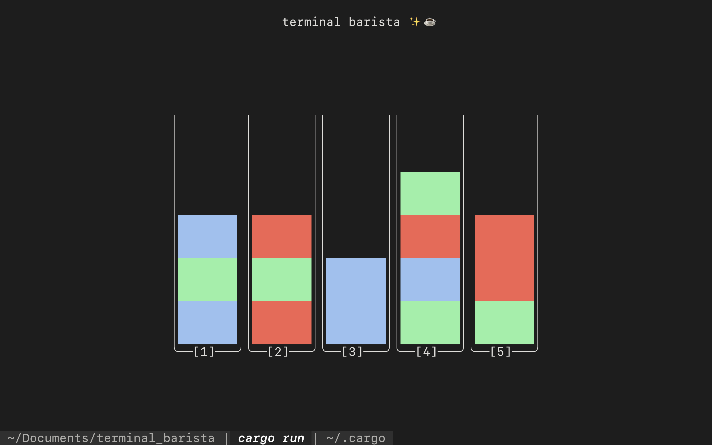

# terminal_barista



Whip up drinks by sorting each color into it's own cup.

A rust tui using [ratatui](https://ratatui.rs/)

## Quickstart:

Playing this game is easy, you can get going with just two commands:
```sh
cargo install terminal_barista
terminal_barista
```

## Controls:

1-9: picks up a cup. Once a cup is picked up, the next number will be the cup that receives liquid from the seelcted cup.

q: Exits the game
